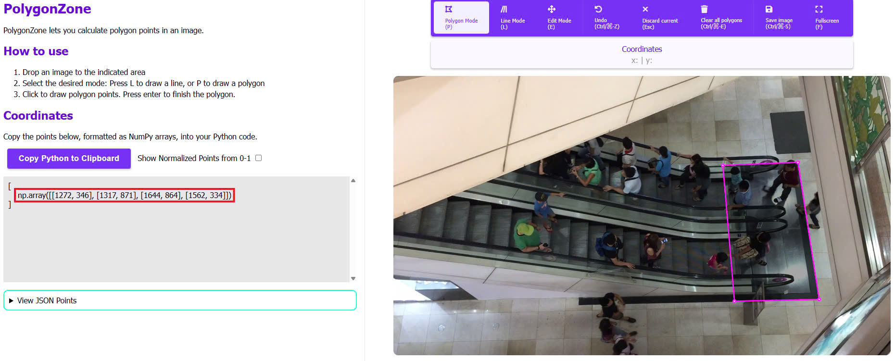

# Computer Vision Object Counter

> Easily count and track objects in video regions using Ultralytics YOLO models with minimal setup.

<a href="https://www.ultralytics.com/"></a>

## ✨ Features

- Region-based object counting with customizable polygons
- Multiple region support for complex monitoring scenarios
- Real-time video processing with on-screen visualization
- Configurable YOLO models (from lightweight to ultra-performance)
- Simple API with minimal code requirements
- Video output generation for analysis and sharing

## 📊 Demo

*Click on the GIFs above to watch the full demo on YouTube*

| Original | Result |
|----------|--------|
| [](https://youtu.be/IuxnOB15ODw) | [](https://youtu.be/XgWEnEZNBw4) |
| [](https://youtu.be/Dv5mya3FQeI) | [](https://youtu.be/HUSMM5BoAlE) |
| [](https://youtu.be/WOpt5hei1c8) | [](https://youtu.be/SEIF9s7-TcA) |
| [](https://youtu.be/0cVeQ_zNdI4) | [](https://youtu.be/fEeg81393s4) |

#### Comparison between models

| 11n (BASIC) | 11x (HIGH) | 8x6 (ULTRA) |
|----------|----------|----------|
| [](https://youtu.be/KLQWOxvzzBE) | [](https://youtu.be/ePtlQ-DPS0c) | [](https://youtu.be/J6mvu5CUQas)

## 🚀 Getting Started

### Prerequisites

- Python 3.8+
- OpenCV
- Ultralytics (latest version)

### Installation

1. Clone the repository:

```bash
git clone https://github.com/username/Computer-Vision.git
cd Computer-Vision
```

2. Create virtualenv:
```bash
# This will create virtualenv
python -m venv venv
# This will run venv
.\venv\Scripts\activate 
```

3. Install dependencies:

```bash
pip install ultralytics opencv-python
```

4. Download YOLO models:

```bash
# This will download the default model (yolov + version) - others will download automatically when used
python -c "from ultralytics import YOLO; YOLO('yolov11n.pt')"
python -c "from ultralytics import YOLO; YOLO('yolov11x.pt')"
python -c "from ultralytics import YOLO; YOLO('yolov8x6.pt')"
```

### Running the Object Counter

For single region counting:

```bash
python region_counter.py
```

For multiple region counting:

```bash
python multi_region_counter.py
```

## 🛠️ Edit Instructions

### Changing Input Videos

Modify the video path in the script:

```python
cap = cv2.VideoCapture("path/to/your/video.mp4")
```

### Defining Region Points

1. First take a frame from your video to extract your desired coordinates:

#### Change path to your video
```bash
VIDEO = "<videoname>.mp4"
```

#### After that run video-frame.py to take frame

```bash
python video-frame.py
```

#### You will get a file name "snapshot.png" in the same folder

2. Go to https://polygonzone.roboflow.com/ to extract your desired coordinates:

</img>

3. Update the region points in your script:

#### For Single Region:
```python
region_points = [(x1, y1), (x2, y2), (x3, y3), (x4, y4)]
```

#### For Multiple Regions:
```python
region_points = {
    "region-01": [(x1, y1), (x2, y2), (x3, y3), (x4, y4)],
    "region-02": [(x1, y1), (x2, y2), (x3, y3), (x4, y4)],
    # Add more regions as needed
}
```

### Switching YOLO Models

Change the model parameter to use different YOLO versions:

```python
# Choose one of these options based on your performance/accuracy needs
model="/model/yolo11n.pt"  # Lightweight (fastest)
model="/model/yolo11m.pt"  # Medium
model="/model/yolo11x.pt"  # Strong
model="/model/yolov8x6.pt" # Ultra (most accurate)
```

### Display and Output Options

To disable real-time display:

```python
counter = solutions.ObjectCounter(
    show=False,  # Set to False to disable display
    region=region_points,
    model="/model/yolo11n.pt",
)
```

To change the output video path:

```python
video_writer = cv2.VideoWriter("path/to/output.avi", cv2.VideoWriter_fourcc(*"mp4v"), fps, (w, h))
```

## 📈 Model Matrix

| Category | Model | Parameters | Speed (FPS) | mAP |
|----------|-------|------------|-------------|-----|
| Light    | yolo11n | 1.8M | 600+ | 37.3 |
| Medium   | yolo11m | 8.7M | 400+ | 44.7 |
| Strong   | yolo11x | 68.2M | 170+ | 53.9 |
| Ultra    | yolov8x6 | 140.7M | 70+ | 56.8 |

*Performance measured on NVIDIA RTX 3090. Your results may vary based on hardware.*

## 🎬 Creating Demo GIFs

Convert video segments to GIFs for documentation:

```bash
# Create original GIF
ffmpeg -i your_video.mp4 -ss 00:00:05 -t 5 -vf "fps=10,scale=400:-1" demo/original.gif

# Create result GIF
ffmpeg -i processed_video.avi -ss 00:00:05 -t 5 -vf "fps=10,scale=400:-1" demo/result.gif
```

## 🤝 Contributing

Contributions are welcome! Please feel free to submit a Pull Request.

1. Fork the Project
2. Create your Feature Branch (`git checkout -b feature/AmazingFeature`)
3. Commit your Changes (`git commit -m 'Add some AmazingFeature'`)
4. Push to the Branch (`git push origin feature/AmazingFeature`)
5. Open a Pull Request

## 📄 License

Distributed under the MIT License. See `LICENSE` for more information.

## 📬 Contact

- **Email**: nguyenminh1301.dev@gmail.com
- **GitHub**: [NguyenMinh1301](https://github.com/NguyenMinh1301)
